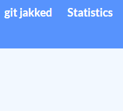
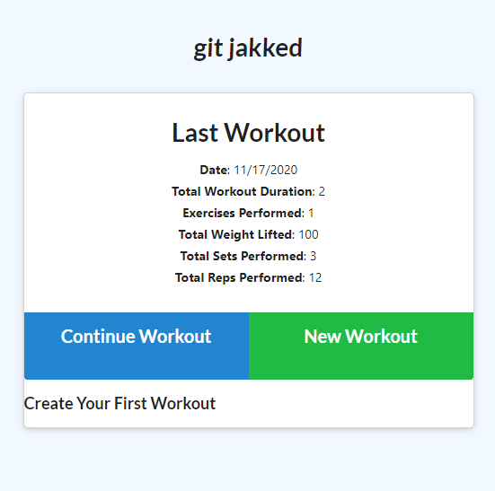
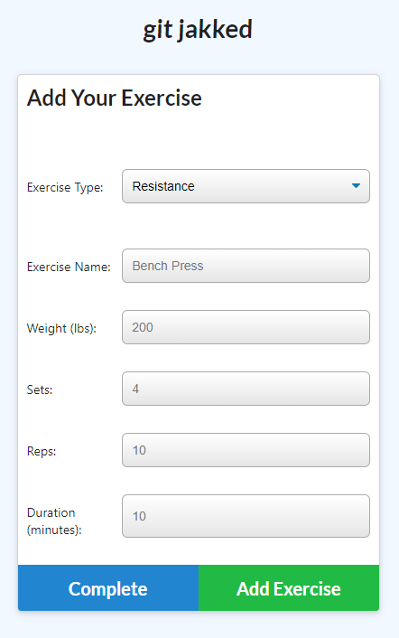
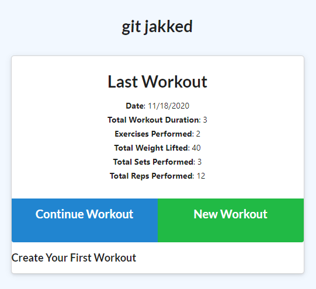
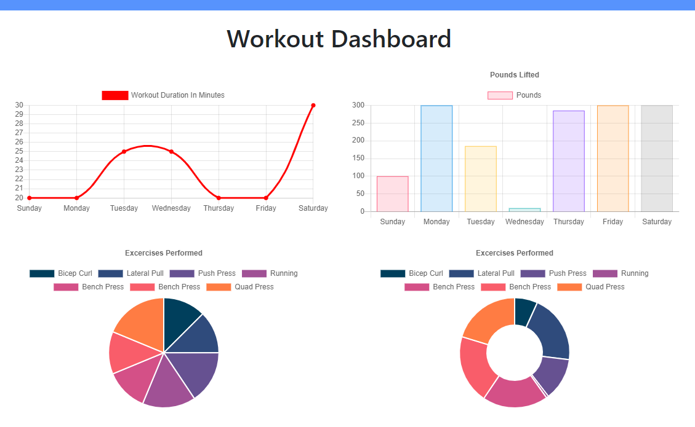

# git_jakked

## Table of Contents
* [Application Flow](#workflow)
* [Description](#description)
* [Installation Instructions](#installation)
* [Usage Information](#usage)
* [Contributors](#contributor)
* [Tests](#tests)
* [License](#license)
* [Questions](#questions)

## Application Flow

#### Navbar

The navbar includes two links: 'git jakked' refreshes the page and allows the user to quickly navigate to the main task window; statistics displays a 7-day running tally of working statistics (weight lifted, miles run or walked, etc.)

#### Task Window

The task window allows the user to create workouts and continue already-created workouts. These are then sent to the statistics page.

#### Create Workout
This is where the workouts are created. Cardio and Resistance create workouts with different criteria.

#### Complete Workout
Clicking the the complete workout button displays the workout, which then is sent to the main page.

#### Workout Statistics
This page graphically displays the workout statistics for a rolling seven-day period.

## Description
This application allows users to track their workouts over a 7 day rolling period. The application keeps track of distance, weights lifted and time working out. It displays statistics if graphic form to give the user a visual method to track their workouts.

## Installation Instructions
This is a web-based application. Go to site at heroku and enter in workouts and stats.

## Usage Information
Free usage for all.

## Contributors
Layne D. Hansen

## Tests 
No.

## License
MIT_license
  

Copyright 2020, Layne D. Hansen

Permission is hereby granted, free of charge, to any person obtaining a copy of this software and associated documentation files (the "Software"), to deal in the Software without restriction, including without limitation the rights to use, copy, modify, merge, publish, distribute, sublicense, and/or sell copies of the Software, and to permit persons to whom the Software is furnished to do so, subject to the following conditions:

The above copyright notice and this permission notice shall be included in all copies or substantial portions of the Software.

THE SOFTWARE IS PROVIDED "AS IS", WITHOUT WARRANTY OF ANY KIND, EXPRESS OR IMPLIED, INCLUDING BUT NOT LIMITED TO THE WARRANTIES OF MERCHANTABILITY, FITNESS FOR A PARTICULAR PURPOSE AND NONINFRINGEMENT. IN NO EVENT SHALL THE AUTHORS OR COPYRIGHT HOLDERS BE LIABLE FOR ANY CLAIM, DAMAGES OR OTHER LIABILITY, WHETHER IN AN ACTION OF CONTRACT, TORT OR OTHERWISE, ARISING FROM, OUT OF OR IN CONNECTION WITH THE SOFTWARE OR THE USE OR OTHER DEALINGS IN THE SOFTWARE.

## Questions

For questions and comments, contact me at:

Github: [LayneHansen](https://github.com/LayneHansen)

Email: laynehansen_dev@gmail.com
    
  